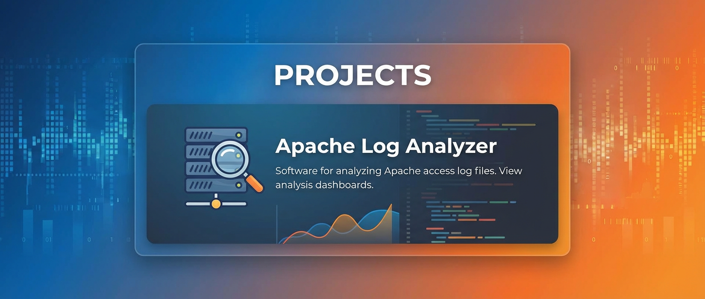

# Equicksales-Apache-Access-LogAnalyzer

This project is about analyzing apache access log. We have been conducting research on developing a tool for apache access log analysis. This research project has culminated into the development of a software for analyzing apache access log files on LAMP Servers. Currently works for Ubuntu Server.

To test this tool download the project files and extract it. Then copy the dist folder in the LogAnalyzerGUIApp. You can double click the LogAnalyzerGUIApp.jar file and the tool will launch.
To be able to download the apache access log file from a remote LAMP server in order to analyze it using the log analyzer GUI app, you need to install Java on the LAMP server and copy the FileTransferServerLib.java file in the Server Script folder onto your LAMP server. Then compaile the file using the command <b>javac FileTransferServerLib.java </b>. To run the FileTransferServerLib.java file you will use the sudo command. As such, it will be <b>sudo java FileTransferServerLib </b>

Note that the project requires <b>Java 24</b> and <b>Java 8</b> installed on your windows computer to make the GUI App work perfectly. Make sure you setup the path to the bin for these two java distributions in your environment variables.
